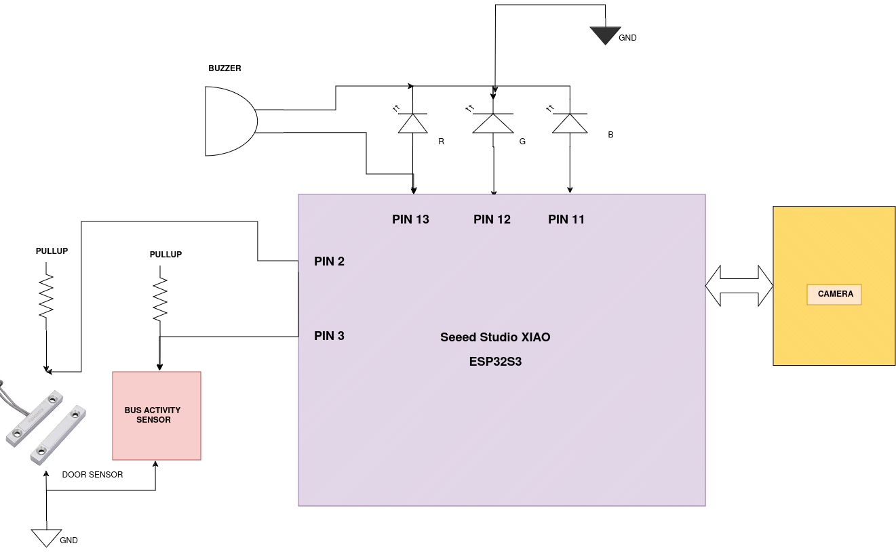
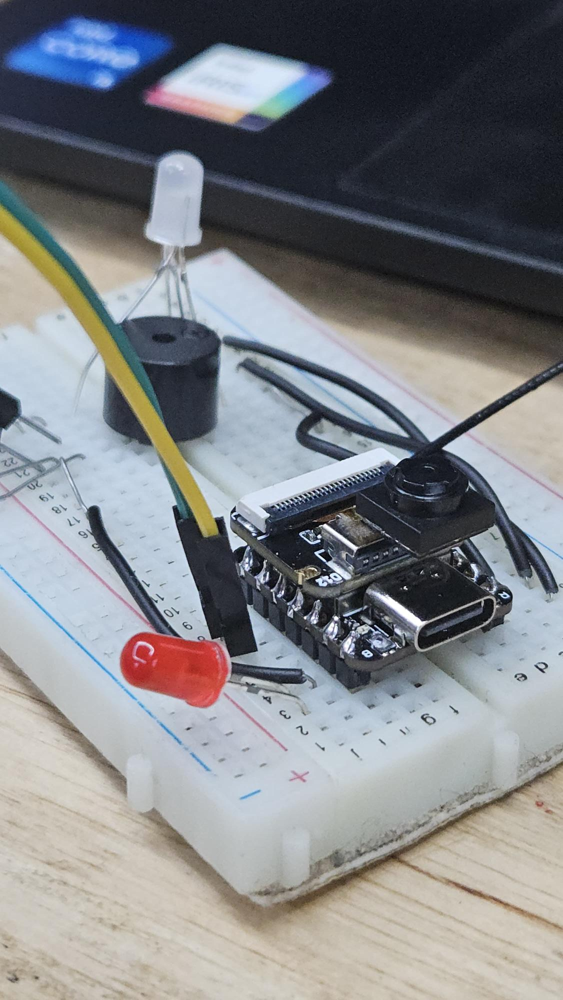

# TinyMLHackathon

## 1. Project Description

The **“Bache Bachavo”** system is designed with the unique challenges faced by small children in mind. Young children may not always be aware of their surroundings or have difficulty understanding the importance of staying seated until the bus is fully stationary. Their smaller size and potential to move around the bus unnoticed can also pose risks, especially if they fall asleep or are too young to alert others. Additionally, children may struggle to manage the exit, especially in emergencies independently, or could get distracted, making it harder for drivers or staff to ensure every child is accounted for.
The **“Bache Bachavo”** system addresses these challenges by automatically detecting if a child remains inside after the bus has stopped and if the doors are properly secured. This minimizes the risks associated with young children's limited awareness and inability to understand safety protocols fully

## 2. The Problem

It was just an ordinary day. A small girl was getting ready to go to her school. She was excited to go to school and play with her friends. Unfortunately, that was her last day. She got trapped inside the bus and died due to extreme heat inside the bus.
This is not just a story; this incident emphasises the need for advanced child safety systems, such as automatic checks to ensure all children are accounted for before buses depart, preventing such tragic occurrences in the future. Like this many such accidents occur around the world

## 3. The Solution

Our solution is like a **high-tech bus guardian**! Once the bus door is closed and the engine is off, the device kicks into action. A camera scans the bus, looking for any little adventurer who might have been left behind also as an additional safety feature system looks for any sounds from these explorers to detect. If the system spots someone, it sounds an alarm and sends a message **“Bache Bachavo”** to a responsible officer, like a superhero ready to swoop in. It’s like having a watchful eye on the bus, making sure no child is forgotten and everyone’s safe

## 4. Technical Details

### Technologies/Components Used

#### For Software

- **Languages**: Arduino C
- **Frameworks**: Laravel (notification setting), Twilio (SMS sending)
- **Libraries**: `esp32.h`, `esp32nn.h`, I2S.h
- **Tools**: Arduino IDE, VS Code, terminal, EdgeImpulse, Docker

#### For Hardware

- **Main Components**:
  - Seeed Studio XIAO ESP32S3
  - OV2340 camera sensor
  - Seeed Studio XIAO BLE Sense nRF52840
  - Buzzer
  - RGB LED common cathode

## 5. Implementation

### Steps in Manual Training

1. Add data to Edge Impulse.
2. Create impulse.
3. Create DSP.
4. Click **“Edit block locally”** from NN.
5. Create a Docker image from the documentation.
6. Run the Docker image and wait for the container to come up.
7. It should automatically start training the network for your setup made online.
8. After training, upload the saved `model.zip` file to a new EdgeImpulse project as **“choose model.”**

### Additional Steps

- Enter model parameters manually.
- Go to deployment.
- Select **Library** as Arduino.
- Select **TensorFlow Lite** as the engine.
- Click build.

## 6. Figures

Hardware Blockdiagram

                               Prototype

## 7. Team Contributions

|            **Name** |          **Role** |
|:--------------------|:------------------|
|       Rishad Alayan |          Hardware |
|          Richu Bini | Voice recognition |
|           Adwaith S |  Person detection |
|       Akshay Joseph |      Notifiaction |
| Anandhu P Anilkumar |       Integration |
